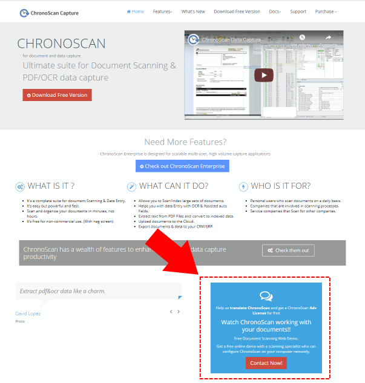

# Contributions

This documentation can be edited on GitHub.

##### <i class="mdi mdi-github"></i>&nbsp;&nbsp;&nbsp;[**Edit on GitHub**](https://github.com/chronoscan-capture/ChronoLite-docs.git)  

##### <i class="mdi mdi-comment-edit-outline"></i>&nbsp;&nbsp;&nbsp;[**Suggest a change**](https://github.com/chronoscan-capture/ChronoLite-docs/issues/new?title=Suggested%20Change%20to%20%22ChronoLite%20documentation%22&body=%3C%21--%20Describe%20how%20you%20would%20improve%20the%20documentation%20here%20--%3E)

## Languages

ChronoLite uses the same languages as ChronoScan Capture Suite.  
If you want to contribute translating ChronoScan and get a **ChronoScan Adv License for free** send us an email to [chronoscan@chronoscan.org](mailto:chronoscan@chronoscan.org?subject=Translation) or visit [chronoscan.org](https://www.chronoscan.org) and look for the following image on the home page.

  
<small class="img_caption">chronoscan.org translation contribution location.</small>

<!--  Fri Oct 30 2020 11:31:08 GMT+0100 (Central European Standard Time)
<pre>
[                                             
  { lang: 'english', '%': 100 },              
  { lang: 'spanish', '%': 99.98 },            
  { lang: 'portuguese-br', '%': 97.25 },      
  { lang: 'turkish', '%': 93.13 },            
  { lang: 'german', '%': 89.64 },             
  { lang: 'croatian', '%': 87.96 },           
  { lang: 'chinese-Hans', '%': 86.72 },       
  { lang: 'dutch', '%': 85.22 },              
  { lang: 'bulgarian', '%': 85.13 },          
  { lang: 'chinese-Hant', '%': 80.52 },       
  { lang: 'portuguese', '%': 68.46 },         
  { lang: 'greek', '%': 61.11 },              
  { lang: 'hebrew', '%': 58.04 },             
  { lang: 'french', '%': 56.18 },             
  { lang: 'lithuanian', '%': 53.01 },         
  { lang: 'polish', '%': 49.16 },             
  { lang: 'serbian', '%': 44.1 },             
  { lang: 'italian', '%': 42.02 },            
  { lang: 'slovenian', '%': 28.56 },          
  { lang: 'czech', '%': 27.13 },              
  { lang: 'catalan', '%': 24 },               
  { lang: 'norwegian', '%': 7.04 },           
  { lang: 'slovak', '%': 5.83 },              
  { lang: 'romanian', '%': 4.06 },            
  { lang: 'vietnamese', '%': 0.62 },          
  { lang: 'arabic', '%': 0.31 },              
  { lang: 'russian', '%': 0 },                
  { lang: 'swedish', '%': 0 },                
  { lang: 'thai', '%': 0 }                    
]                                             
</pre>
-->