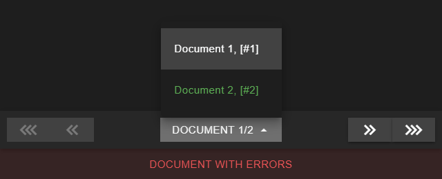

# Documents pagination

Located at the bottom of the indexer form.

  
<small class="img_caption">Documents pagination</small>

* <i class="mdi mdi-chevron-triple-left"></i> Go to first document.
* <i class="mdi mdi-chevron-double-left"></i> Go to previous document.
* **Document [current document]/[total documents] menu**: Go to a specific document.
* <i class="mdi mdi-chevron-double-right"></i> Go to next document.
* <i class="mdi mdi-chevron-triple-right"></i> Go to last document.