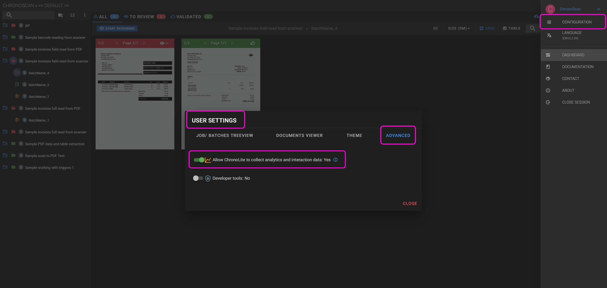

# Analytics & data collection

Users will be asked the first time the dashboard is entered if they allow the application to send analytics and collect user interaction data. 

* Data collection is under [**ChronoScan Capture’s Privacy of Information Policy and GDPR**](https://www.chronoscan.org/company_privacyPolicy.asp).
* Internet connection is necessary to activate this feature.
* All data collected is only used for developers to improve performance and users experience.
* It is optional and it can always be changed under 'User menu' / 'User settings' / 'Advanced'.
* Default value for this setting is: No

  
<small class="img_caption">Analytics and user interaction data collection switch. </small>

