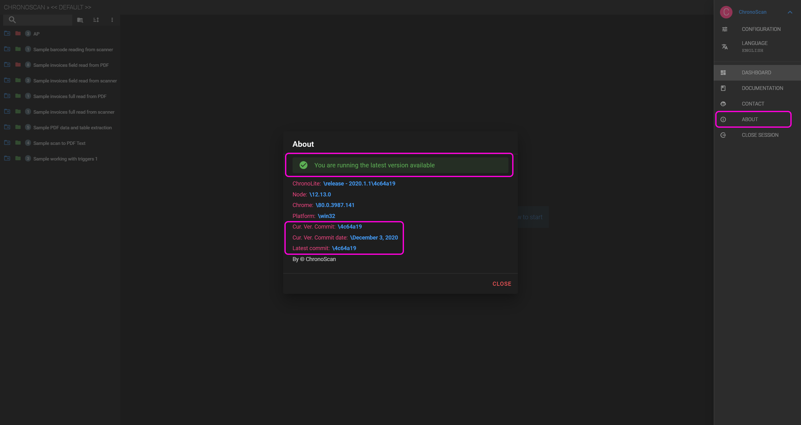

# Checking current version

You can check your current version of ChronoLite or if there is a newer version available on 'Menu' / 'About'.

  
<small class="img_caption">Check current version location. </small>

