# Dashboard

The dashboard is the main application section. It is divided into two mayor components and the user menu.

> **Note:** For Enterprise configurations an [user login](./documentation/chronolite/dashboard/enterprise-login/index) is required to access the dashboard.

* [Job/ batches treeview](#job-batches-treeview). In magenta  
* [Documents viewer](#documents-viewer). In orange  
* [User menu](#user-menu) &nbsp;&nbsp;<i class="mdi mdi-menu" style="color: white;"></i>

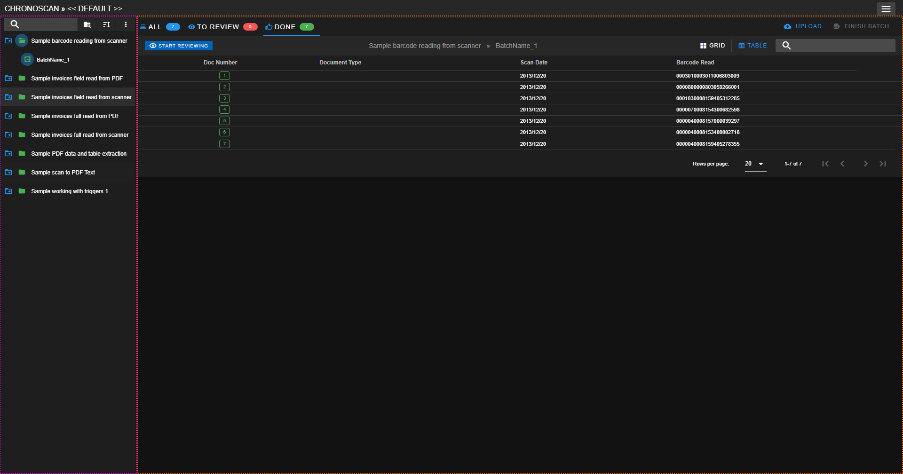  
<small class="img_caption">chronolite dashboard: </small><small class="in_magenta">Job/ batches treeview</small> <small>&</small> <small class="in_orange">Documents viewer</small>

# Job/ batches treeview

The Job/ batches treeview is where your jobs/ batches are listed, so you can easily find and access them as well as do some actions on your jobs.

The main components of the treeview are:

* The treeview toolbar
* The job/ batches explorer
* The job actions menu

### The treeview toolbar

Located on top of the treeview  

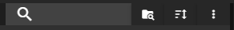  
<small>Job/ batches treeview toolbar</small>

* This toolbar provides options such as
    * **Search** your job/ batches by their names [*contains]
    * **Filter** your jobs by their validation status: <strong style="color: green">validated</strong> or <strong  style="color: red">not validated</strong>.
    * **Order options**
    * **More options**
        * **Refresh dashboard**
        * **Locate current batch**

### <i class="mdi mdi-folder"></i> The job/ batches explorer

The job/ batches explorer is used to navigate and select the batch we want to see the documents for.

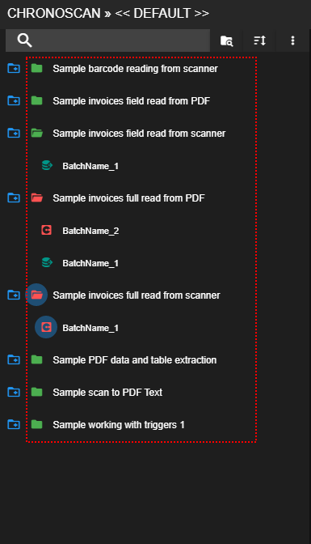  
<small class="img_caption">Job/ batches explorer</small>

When a batch is clicked, this is loaded and its documents are listed on the documents viewer dashboard section.

Job/ batches explorer icon legend:

* <i class="mdi mdi-folder" style="color: green"></i> Job with all batches validated.
* <i class="mdi mdi-folder" style="color: red"></i> Job with at least one batch with errors.
* <i class="mdi mdi-minidisc" style="color: green"></i> Batch with all documents validated.
* <i class="mdi mdi-minidisc" style="color: red"></i> Batch with at least one document with errors.
* <i class="mdi mdi-minidisc" style="color: silver"></i> Empty batch.
* <i class="mdi mdi-database-export teal"></i> Batch exported successfully.
* <i class="mdi mdi-database-export" style="color: orange"></i> Batch exported with errors.

### The job actions menu

Blue outlined folder located to the left of the main job folder.
When is active it turns magenta and it opens a dropdown menu with the following job actions.

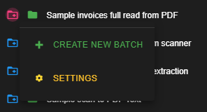  
<small class="img_caption">Job actions menu opened</small>

* [**Create a new batch**](#create-a-new-batch)
* [**Settings**](#settings)

#### Create a new batch

chronolite allows you to create new batches on your jobs.

To do so, open the Job actions menu > create new batch > enter a name for your new batch > click on select documents and choose the files to upload. 

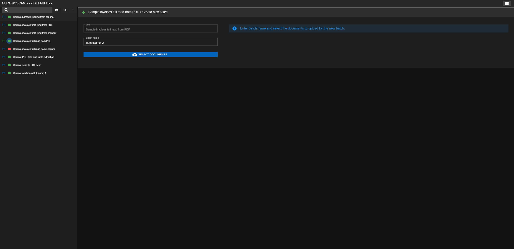  
<small class="img_caption">Create a new batch job action</small>

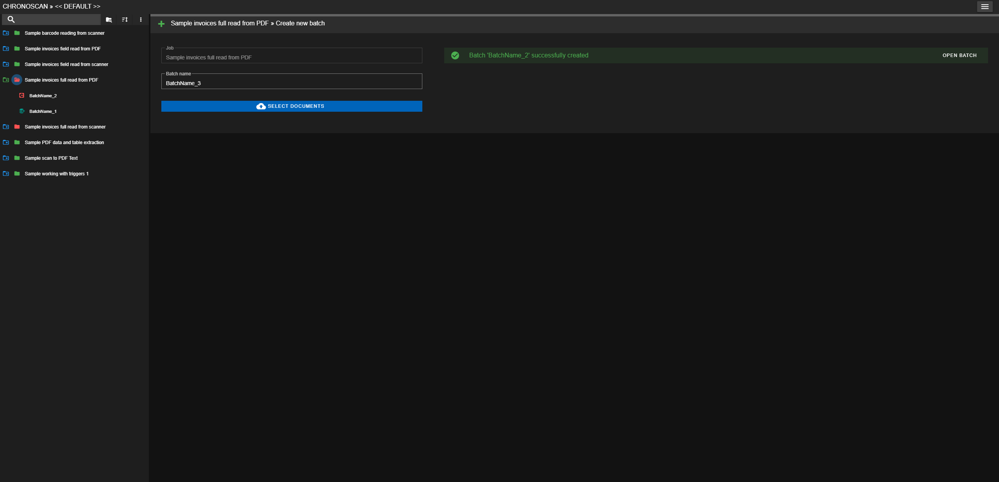  
<small class="img_caption">Batch created successfully</small>

#### <i class="mdi mdi-cog" style="color: gold;"></i> Settings

This action allows you to configure some options for the selected job.

On current version we are able to select the Jobs fields to appear on the [Documents viewer table](#table-view)

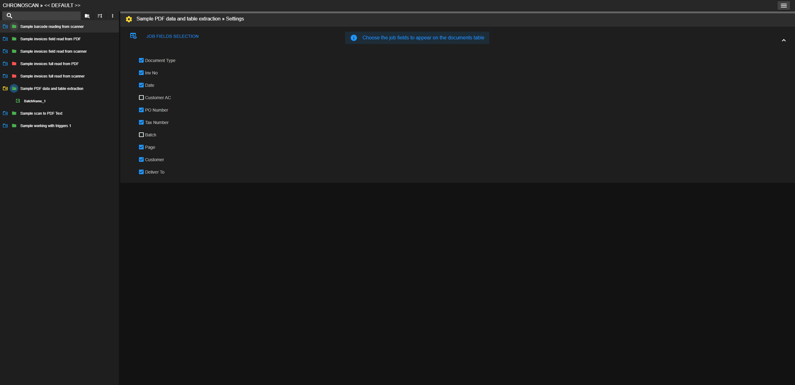  
<small class="img_caption">Selecting fields to appear on ducuments viewer table for a specific job</small>

# Documents viewer

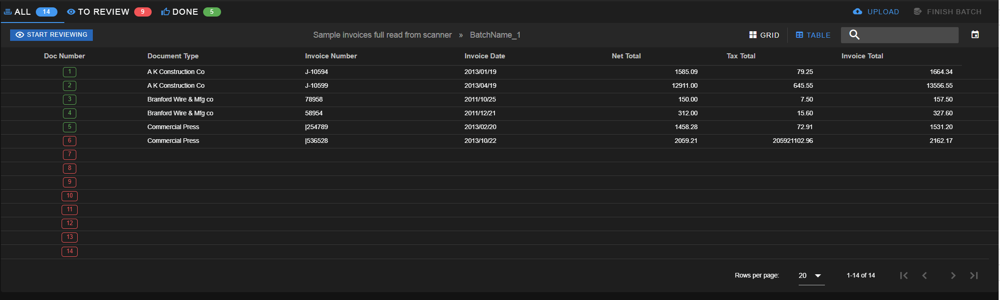  
<small class="img_caption">Dashboard documents viewer</small>

The documents viewer is where the selected batch documents are listed. It is organized by three inboxes. 

* ### Documents viewer toolbar

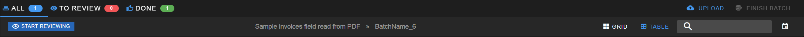  
<small>Documents viewer toolbar</small>  

The components of the documents viewer toolbar are

#### Inboxes
* ALL
    * List of all documents for selected batch.
* TO REVIEW
    * List of documents with validation errors.
* DONE 
    * List of validated documents.

#### Action buttons
* <i class="mdi mdi-cloud-upload chrono_blue"></i> Upload documents button (See [Uploading documents to a batch](#uploading-documents-to-a-batch)).
* <i class="mdi mdi-database-export" style="color: green"></i> Finish batch button (See [Exporting a batch from chronolite](#exporting-a-batch-from-chronolite)). 

#### Tool buttons
* <i class="mdi mdi-magnify"></i> Search bar for filtering documents by any job field value [*contains].
* <i class="mdi mdi-eye-outline chrono_blue"></i> Start reviewing button.
    * When we click this button, the [**indexer**](./../../../documentation/chronolite/indexer/index.md) will be opened to index/ correct the listed documents on the table/ grid viewer.
    * If a search documents it's being applied, **only the listed documents** will be openened.
* <i class="mdi mdi-calendar"></i> Filter documents by date of creation (Upload date). (ISO 8601)
    * Any default
    * Today
    * Yesterday
    * This week
    * This Month
    * Last Month
    * Custom date
        * Custom date gives you the option of selecting a range of dates to filter  
        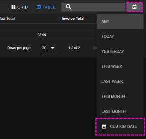  
        <small>Custom date opening</small>
        * Custom date calendars selection  
        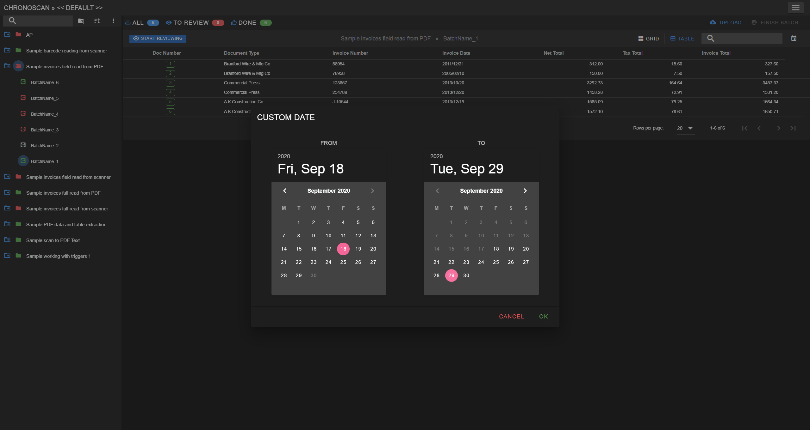  
        <small>Custom date calendars</small>
        > **Note** When date filter is applied, a notification appears on top of the documents view.  
        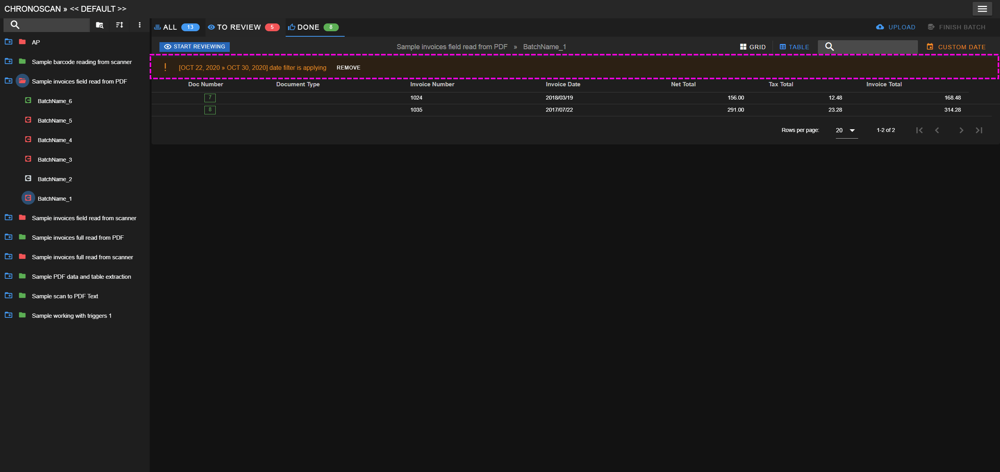  
        <small>Date alert</small>        

* <i class="mdi mdi-table"></i> Button to view the documents as a table.
* <i class="mdi mdi-grid-large"></i> Button to view the documents as a grid of images.
    * When the grid view is active this other options are be available:  
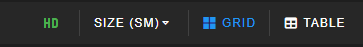  
        * <i class="mdi mdi-high-definition" style="color: green; font-size: large"></i> It toggles high definition on listed images
        * SIZE. Size of listed images as thumbs per row.
            * 6 / Small
            * 4 / Medium
            * 2 / Large

## Table view

The table view shows the documents fields and current values.

Each row is a document and it can be selected. When a row is clicked over a dropdown menu appears.

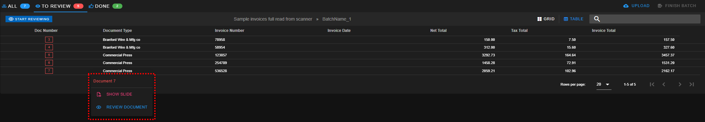  
<small>Document menu</small>

* <i class="mdi mdi-file-eye-outline" style="color: magenta"></i> Show slide
    * A document preview slide will appear on the right of the dashboard
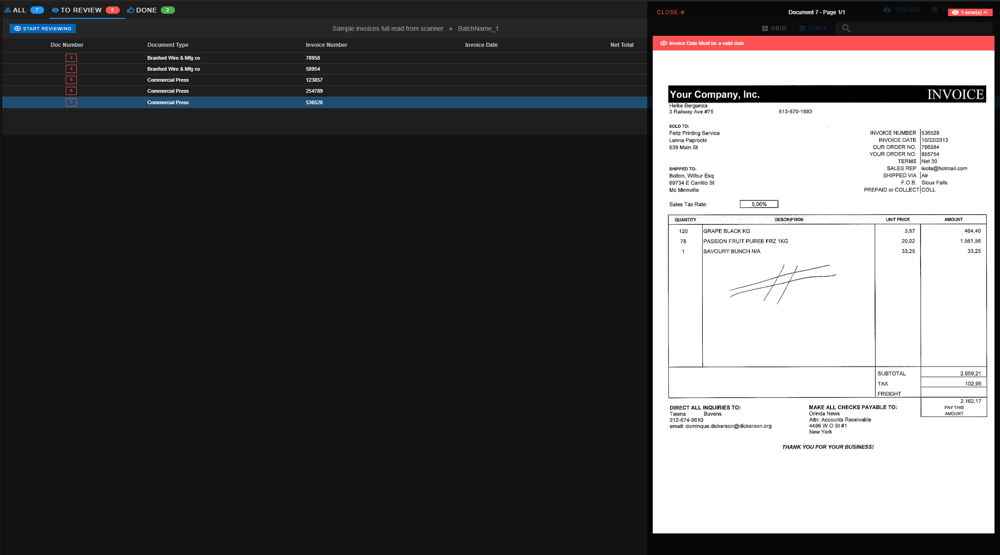
* <i class="mdi mdi-eye-outline chrono_blue"></i> Review document
    * Start reviewing listed documents from selected document position.

## Grid view

The grid view shows the documents as images.  
Functionality is similar to the table view, and a document can be reviewed directly as well by hovering and image
and clicking on the <i class="mdi mdi-eye-outline chrono_blue"></i> button.

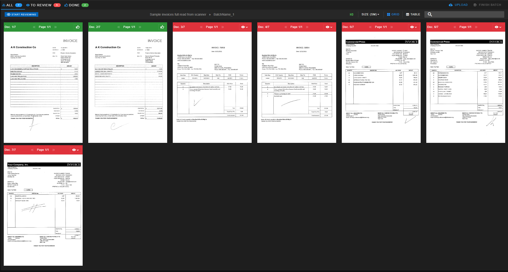
<small class="img_caption">Grid view</small>

