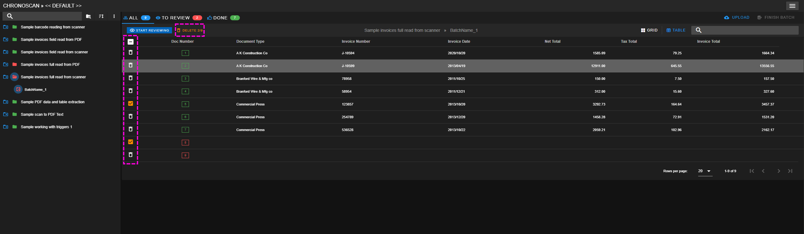
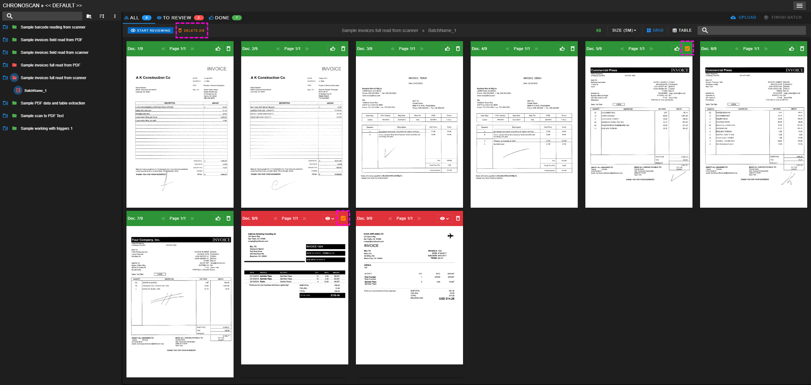

## Deleting documents

Documents can be deleted if the user menu > user settings option > <i class="mdi mdi-delete-outline" style="color: orange;"></i>  [**Allow delete documents**](./documentation/chronolite/dashboard/user-menu/index?id=user-settings) is enabled.

Once this option is enabled, documents can be selected in either the table view or the grid view and be deleted by clicking in the Delete button.  

<small class="img_caption">Deleting document on table view</small>

<small class="img_caption">Deleting documents on grid view</small>

