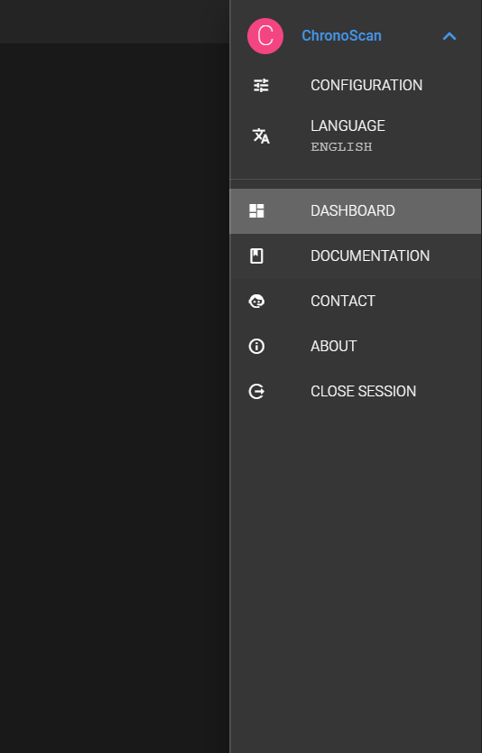
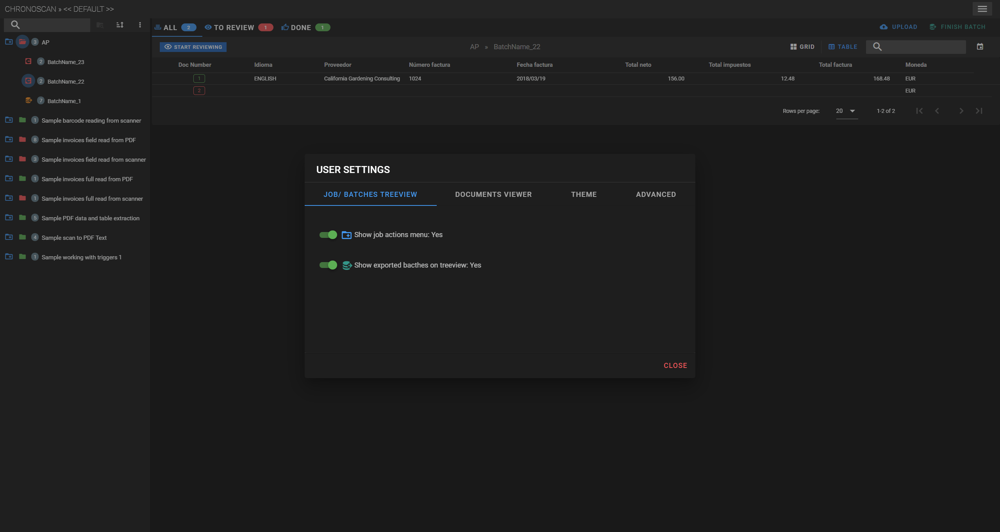

# User menu

The user menu <i class="mdi mdi-menu" style="color: white;"></i> is located in the top-right
corner of the dashboard and it has the following options.

<small class="img_caption">User menu</small>

## User settings

The user settings <i class='mdi mdi-tune'></i> provides some features for the application interface.  

<small class="img_caption">User settings</small>

* <i class='mdi mdi-delete-outline' style="color: orange"></i> Allow delete documents
    * Default value is: NO
    * It shows/ hides the delete document option on the dashboard In magenta
* <i class='mdi mdi-folder-plus-outline chrono_blue'></i> Show job actions menu
    * Default value is: YES
    * It shows/ hides the [job actions menu](#job-actions-menu) In yellow  
* <i class='mdi mdi-database-export teal'></i> Show exported batches on treeview
    * Default value is: YES
    * It shows/ hides the exported batches on the [job/ batches treeview](#job-batches-treeview) In blue
* <i class='mdi mdi-calendar grey'></i> Date created filter in ISO format
    * Default value is: YES
    * In ISO date format weeks start on Mondays and end in Sundays.

<small class="img_caption">User settings toggles</small>
