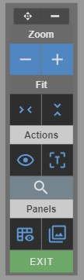
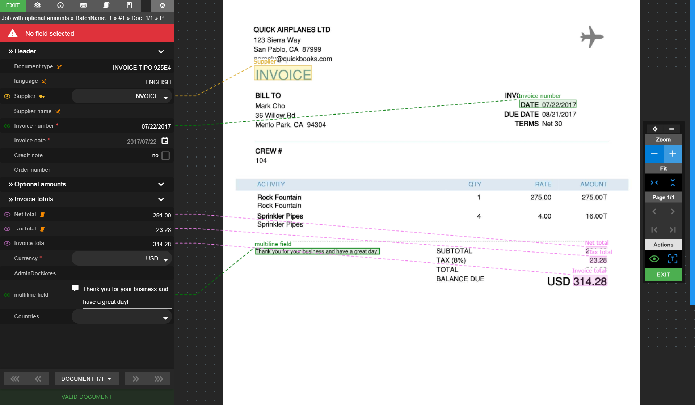
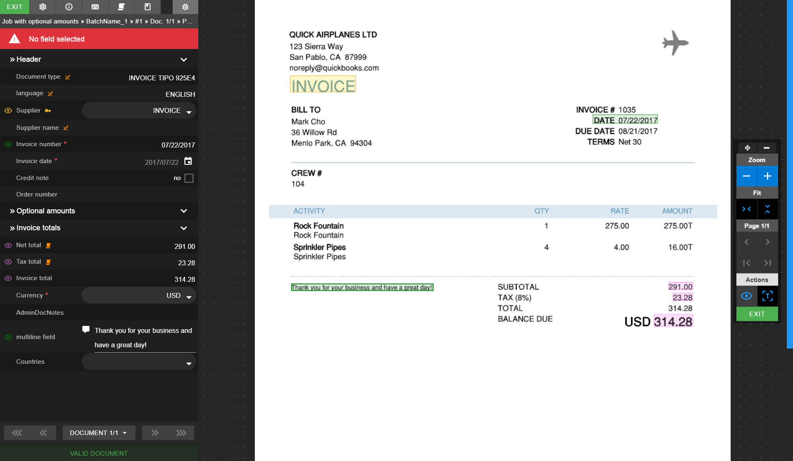
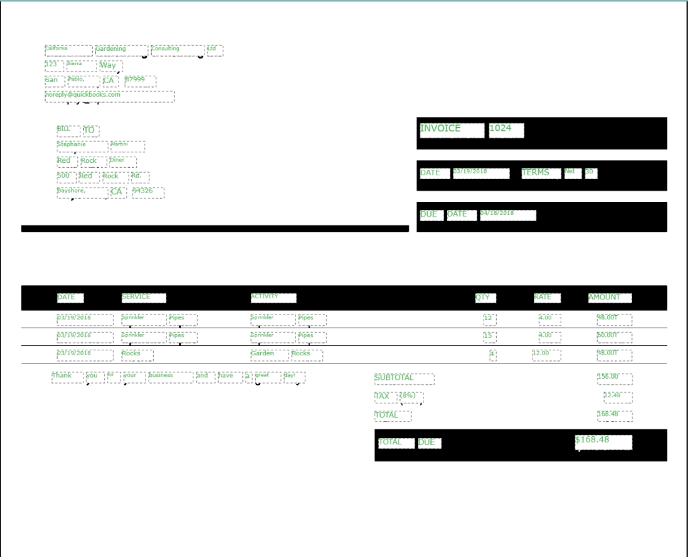
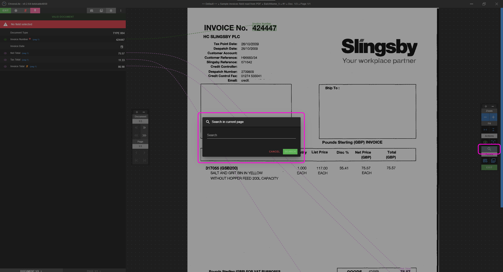

# Controls menu

The controls menu provides options over the image viewer.

  
<small class="img_caption">Controls menu</small>

### Options

* <i class="mdi mdi-drag-variant"></i> Drag and drop the controls menu to another position
* <i class="mdi mdi-window-minimize"></i> Minimize the controls menu
* <i class="mdi mdi-window-maximize" style="color: red"></i> Maximize the controls menu
* **Zoom**
    * <i class="mdi mdi-plus chrono_blue"></i> Zoom in
    * <i class="mdi mdi-minus chrono_blue"></i> Zoom out
* **Fit**
    * <i class="mdi mdi-unfold-less-vertical chrono_blue"></i> Fit image vertically relative to the image viewer
    * <i class="mdi mdi-unfold-less-horizontal chrono_blue"></i> Fit image horizontally relative to the image viewer
* **Page [current page]/[total pages]**
    * <i class="mdi mdi-chevron-left"></i> Go to previous document's page
    * <i class="mdi mdi-chevron-right"></i> Go to next document's page
    * <i class="mdi mdi-page-first"></i> Go to first document's page
    * <i class="mdi mdi-page-last"></i> Go to last document's page
* **Actions**
    * <i class="mdi mdi-eye-outline"></i> Field to area lines activator
        * <i class="mdi mdi-eye-outline" style="color: green;"></i> Field to area lines activated  

            

        * <i class="mdi mdi-eye-outline chrono_blue"></i> Field to area lines deactivated  

            

    * <i class="mdi mdi-text-recognition"></i> Text recognition activator  
        * <i class="mdi mdi-text-recognition" style="color: green;"></i> Text recognition activated  

            

    * <i class="mdi mdi-magnify"></i> Search in page  
          