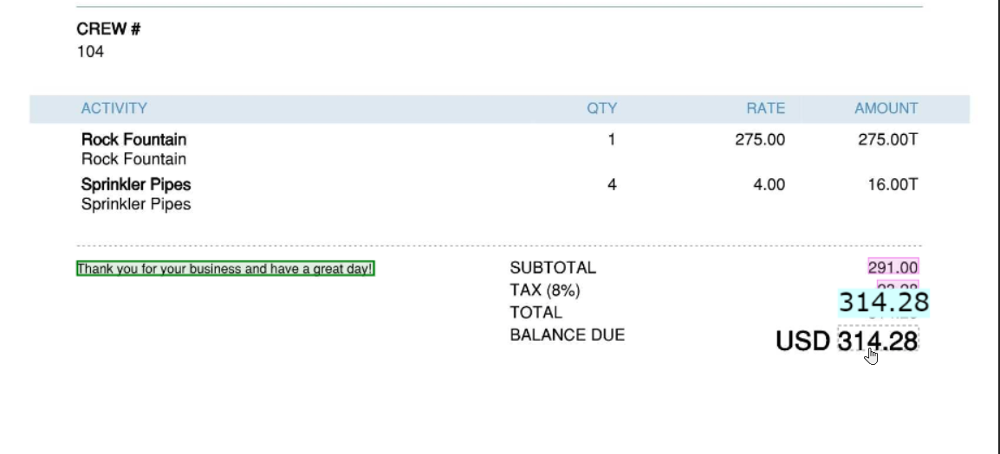
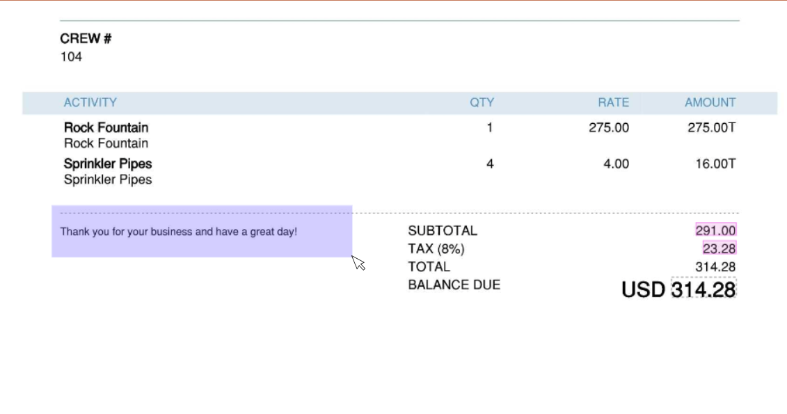

# Field areas

Field areas are an important concept for the image viewer.
They represent the values that have been either designated by ChronoScan processing or by user selection.

As in the form viewer [Field values linked to image areas](./documentation/chronolite/indexer/form/index?id=field-values-linked-to-image-areas), 
a coloured area represents a type of field.

### Selecting values from the image.

Form field values can be filled in by selecting text on the image viewer.
To do so, it is important to focus the field we want to enter its value from an image area and the select the text directly by clicking on a recognized text
or by drawing a zone with the mouse over the area we want to select the values from.

* Selecting a single value from the image
    >  Hover directly on a recognized text and press mouse right button

  

<small class="img_caption">Single text area selection </small>  

* Selecting multiple recognized text by drawing a zone on the image viewer
    >  Hold mouse right button down, draw a zone and release the button

  

<small class="img_caption">Multiple text field area selection </small>  

### Deleting field areas

#### 1. Deleting field areas when pop-up forms are activated

Select either the field with the area or the area itself to make the pop-up form appear.

* Once the pop-up form is visible, see the two buttons inside the Rectangle on below image

  
<small class="img_caption">Deleting text areas areas with pop-up form</small>

* <i class="mdi mdi-close-circle" style="color: red;"></i> Delete text area and **also the field value**
* <i class="mdi mdi-texture-box" style="color: red;"></i> Delete **only** the text area

#### 2. Deleting field areas when pop-up forms are deactivated

When the pop-up form are deactivated (See [indexer settings](./documentation/chronolite/indexer/indexer-settings/index)) the button to delete a text area is located in the field infomation panel on the form.

  
<small class="img_caption">Deleting text areas with no pop-up form</small>

