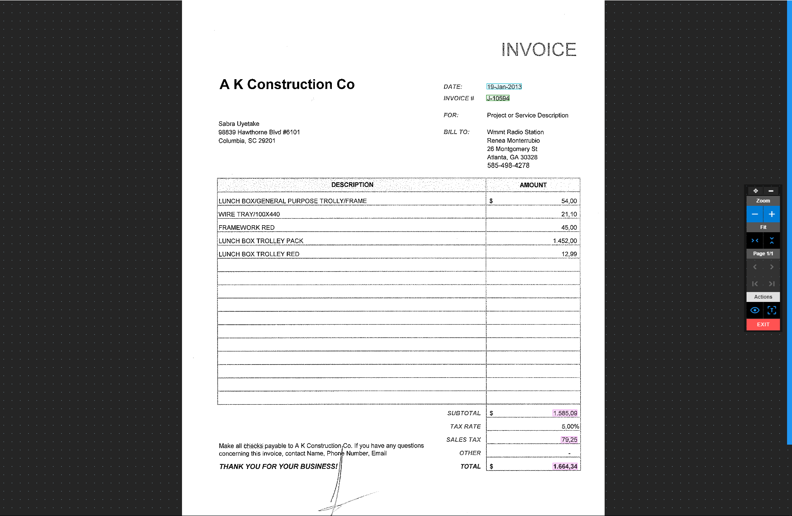
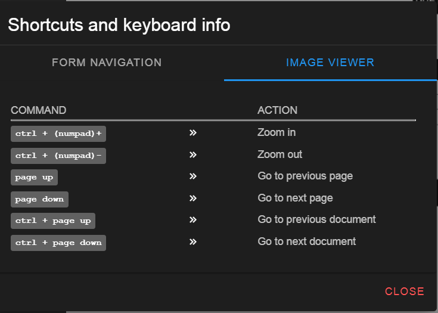

# The Image viewer

The image viewer holds the current document page we are working on and the image viewer control menu.

  
<small class="img_caption">Image viewer</small>

### Image viewer keyboard shortcuts

  ./../../../../../
<small class="img_caption">Image viewer keyboard shortcuts</small>
