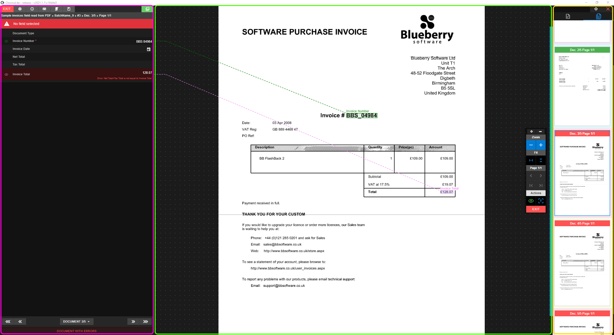

# Indexer

The Indexer is the main tool for correcting and indexing documents.

Its divided into two mayor components plus the thumb viewer:

* [**The form**](./documentation/chronolite/indexer/form/index) In magenta
    * Form toolbar
    * Form fields
    * Documents pagination
    * pop up form

* [**The image viewer**](./documentation/chronolite/indexer/image-viewer/index) In green
    * Document image
    * Image viewer menu

* [**The thumb viewer**](./documentation/chronolite/indexer/thumb-viewer/index) In yellow
    * Toolbar
    * Tabs
    * Thumbs

  

