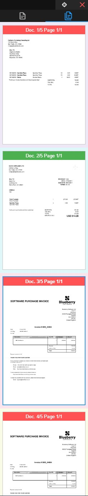
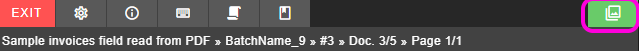

# Thumb viewer

* The thumb viewer lets you preview and navigate thtough all documents opened on the indexer
* It is an **optional** widget that can be opened and closed on demand
* It is composed of three main components
    * Toolbar
    * Tabs bar
    * Image thumbs

!> By default the thumb viewer does not show when entering the indexer for the first time

  

<small class="img_caption">*Thumbs viewer</small>

## Opening and closing the thumb viewer

* The thumb viewer can be opened and closed on the following form view button.
* It can also be closed on thumb viewer toolbar button <i class="mdi mdi-close" style="color: red;"></i>

  

<small class="img_caption">*Opening/ closing thumb viewer button on form main toolbar</small>

## Toolbar

* <i class="mdi mdi-target"></i> Locates current working document page
* <i class="mdi mdi-close" style="color: red;"></i> Closes Thumb viewer

## Tabs bar

* <i class="mdi mdi-file-document-outline"></i> It shows only current documents and pages thumbs
* <i class="mdi mdi-file-document-multiple-outline" style="color: red;"></i> It shows all documents and pages for indexing documents

## Thumbs

* It shows the image thumbs of the documents and pages depending on selected tab
* It shows validation state of documents on page information background color. Green for validated, red for document with errors
