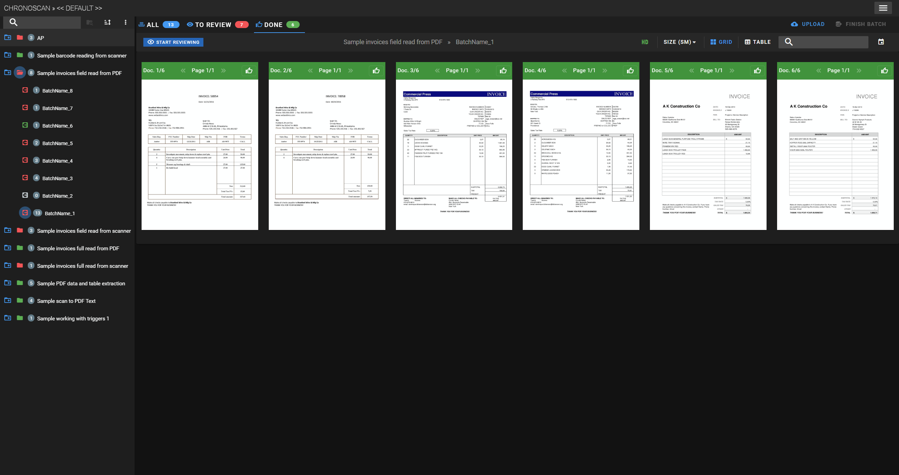
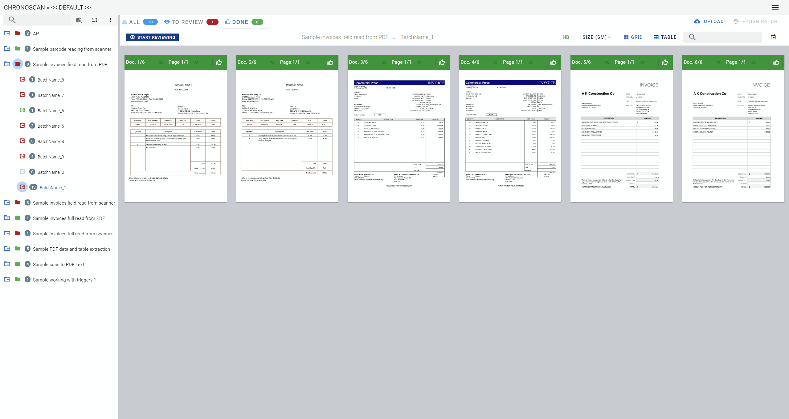

# Themes

> ChronoLite has two different themes: **Dark** & **light**.

## Dark theme

Dark is the default theme of ChronoLite.

<small class="img_caption">Dark theme dashboard</small>

## Light theme

To change between themes see [User settings / Theme](./documentation/chronolite/dashboard/user-menu/index?id=theme).

<small class="img_caption">Light theme dashboard</small>

