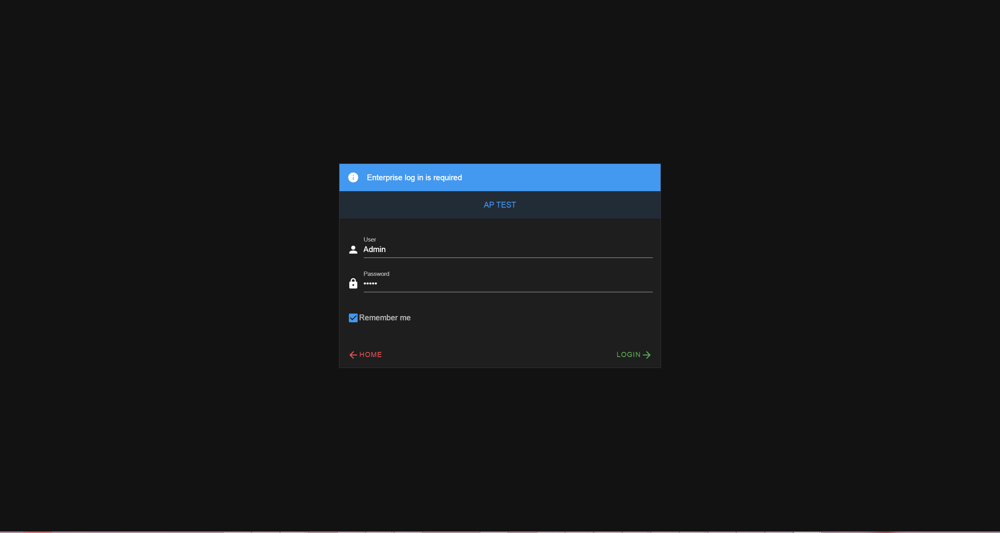

# Enterprise user login

If we are opening a configuration for a **ChronoScan Enterprise**, a valid user must successfully log in to enter chronolite.

  
<small>User log in form Enterprise configurations</small>

