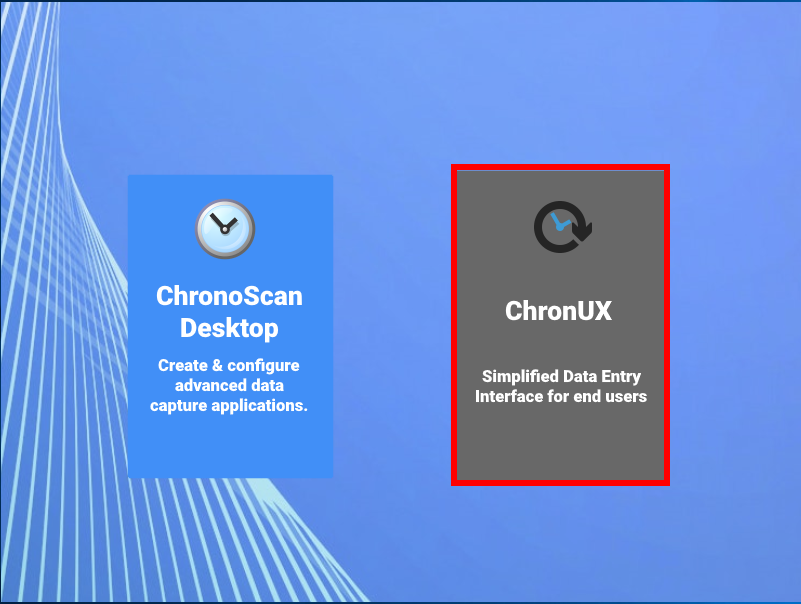

# ChronoScan & ChronoLite

ChronoScan Capture Suite and ChronoLite are two different applications.

* ChronoScan Capture is indepentent of ChronoLite and it can be used as usual as your document managing application.
* ChronoLite in the other hand, is a ChronoScan Plug-in and in order to be used, it needs a ChronoScan Capture application installed.

When ChronoScan Capture Suite is installed in your pc, it will automatically install ChronoLite as a separate and optional destktop application.

<!---->
 

    

        <!---->

  
        <small class="img_caption">ChronoScan launcher icon</small>
    

    

        <!---->

  
        <small class="img_caption">ChronoLite launcher icon</small>
    

 

## Starting ChronoLite

* Start ChronoScan and select the ChronoLite provided option.

  
<small class="img_caption">Running ChronoLite from ChronoScan Capture Suite.</small>

* If you have more than one ChronoScan configuration You can start ChronoLite from ChronoScan by opening ChronoScan and clicking in the <i>Run ChronoLite button</i>

> **Note:** When running ChronoLite this way, ChronoLite will automatically be opened with the selected configuration.

  
<small class="img_caption">Running ChronoLite from ChronoScan Capture Suite.</small>

