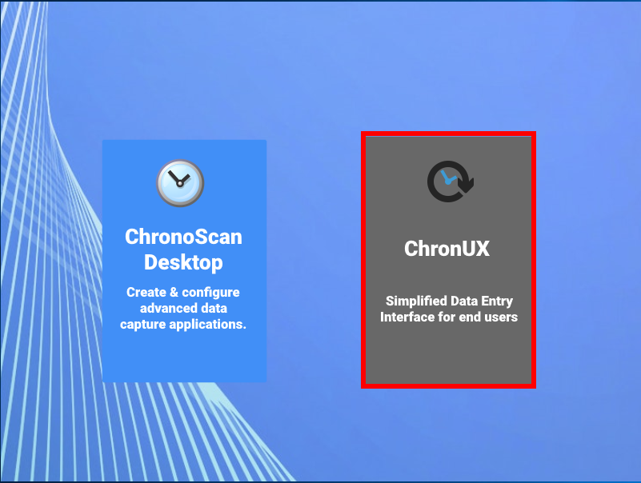
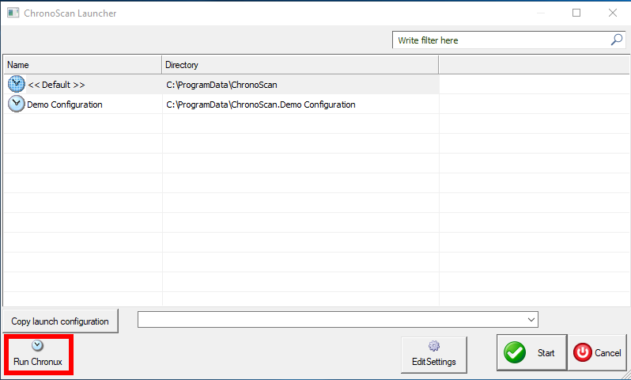

# ChronoScan & Chronux

ChronoScan Capture Suite and Chronux are two different applications.

* ChronoScan Capture is indepentent of Chronux and it can be used as usual as your document managing application.
* Chronux in the other hand, is a ChronoScan Plug-in and in order to be used, it needs a ChronoScan Capture application installed.

When ChronoScan Capture Suite is installed in your pc, it will automatically install Chronux as a separate and optional destktop application.

<!---->
 

    

        <!---->

  
        <small class="img_caption">ChronoScan launcher icon</small>
    

    

        <!---->

  
        <small class="img_caption">Chronux launcher icon</small>
    

 

## Starting Chronux

* Start ChronoScan and select the Chronux provided option.

  
<small class="img_caption">Running Chronux from ChronoScan Capture Suite.</small>

* If you have more than one ChronoScan configuration You can start Chronux from ChronoScan by opening ChronoScan and clicking in the <i>Run Chronux button</i>

> **Note:** When running Chronux this way, Chronux will automatically be opened with the selected configuration.

  
<small class="img_caption">Running Chronux from ChronoScan Capture Suite.</small>

