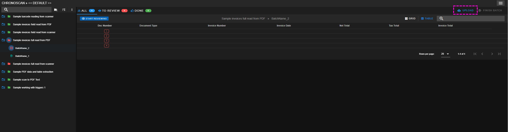

## Uploading documents to a batch

Documents can be added to an existing batch from Chronux by opening a batch and clicking on the <i class="mdi mdi-cloud-upload chrono_blue"></i> UPLOAD Button.  

<small class="img_caption">Upload button</small>