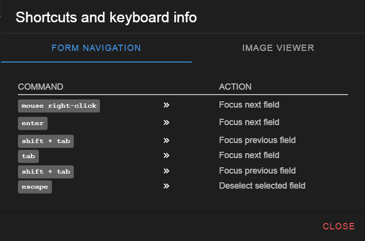
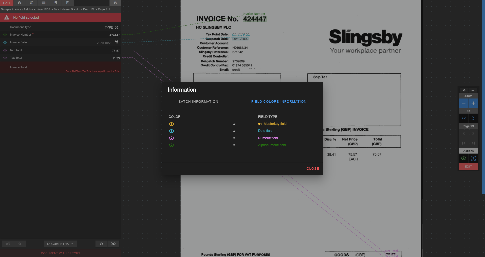
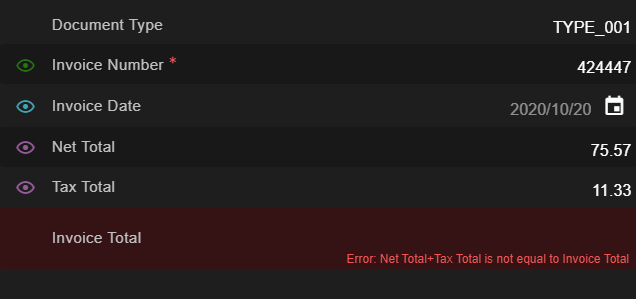

# The form

The form is where the job fields and their values are shown.  
The fields can be corrected from here as well as they will provide us with important information regarding the actual document state.  

Fields can be corrected in three different ways:

* Focusing a field and entering a value directly.
* Focusing a field and selecting an area form the image on the [**Image viewer**](./../../../../documentation/chronux/indexer/image-viewer/index).
* Focusing a field and entering a value on the [**Pop-up field form**](./../../../../documentation/chronux/indexer/pop-up-field-form/index).

## Moving around fields

To move around fields, either use your mouse directly or the following keyboard shortcuts.  

  
<small class="img_caption">Form shortcuts</small>

## Field values linked to image areas

* Field values can be linked to an OCR value detected on the image.  
* In that case an <i class="mdi mdi-eye-outline"></i> icon will appear to the left of the field.  
* The color of the icon, line from field to area and area tell us what type of field is:  

  
<small class="img_caption">Types of field areas</small>

## Fields with validation errors

If a field has a validation error, this will appear on red background color and the error will be listed down below the field's value.  

  
<small class="img_caption">Field with error</small>

