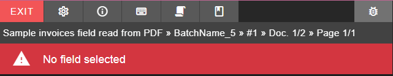
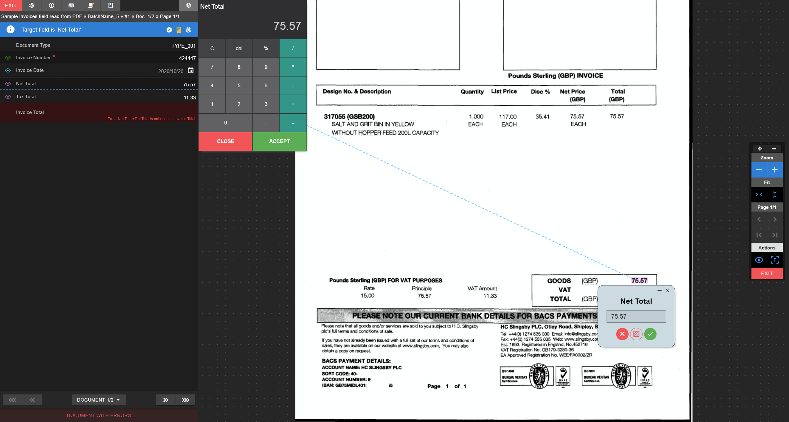

# Form toolbar

Located on on top of the form fields.  

  
<small class="img_caption">Form toolbar</small>

First row: Buttons.

* EXIT Exit back to dashboard.
* <i class="mdi mdi-cog"></i> [Indexer settings](./../../../../documentation/chronux/indexer/indexer-settings/index).
* <i class="mdi mdi-information-outline"></i> Indexer information.
* <i class="mdi mdi-keyboard-outline"></i> Indexer keyboard shortcuts.
* <i class="mdi mdi-script"></i> Scripts log.
* <i class="mdi mdi-book-outline"></i> Indexer documentation.

Second row: Info.

* Job name > batch name > pagination information.

Third row: Field selected information.

### No field selected

  
<small class="img_caption">No field selected</small>

### Current field selected

  
<small class="img_caption">Current field selected</small>

* <i class="mdi mdi-close-circle"></i> Deselects current field.
* <i class="mdi mdi-calculator" style="color: gold"></i> Calculator*
> *Calculator is only available for NUMERIC fields.

  
<small class="img_caption">Calculator snapshot</small>

