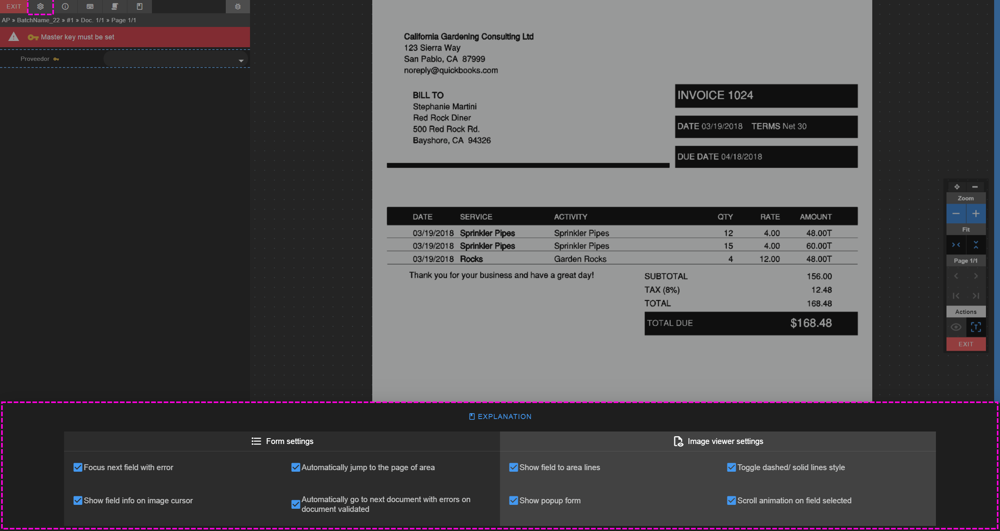

# Indexer settings

<i class="mdi mdi-cog"></i> The indexer settings allows you to customize some options for both the [indexer form](./../../documentation/chronux/indexer/form/index) and the [image viewer](./../../documentation/chronux/indexer/image-viewer/index)

  
<small class="img_caption">Indexer Settings</small>

* <i class="mdi mdi-format-list-bulleted-square"></i> **FORM SETTINGS**
    * **Focus next field with error**
        * Default value is: TRUE
        * If set to TRUE, jumping form fields with tab, right click or enter will automatically focus the next field with errors
        * If no field with errors is found it will jump to next natural form field
    * **Show field info on image cursor**
        * Default value is: TRUE
        * Shows/ Hide the cursor field info  
        
          
        <small class="img_caption">Field info on image cursor</small>
    * **Automatically jump to the page of area**
        * Default value is: TRUE
        * If a field has an area that is not in the current page, jump to the page where the area is located on field focus
    * **Automatically go to next document with errors on document validated**
        * Default value is: TRUE
        * If set to true, at the very moment the current document goes from a state of not valid to validated, the indexer will jump to the next document with errors

* <i class="mdi mdi-file-eye-outline"></i> **IMAGE VIEWER SETTINGS**
    * **Show field to area lines**
        * Default value is: TRUE
        * If set to TRUE lines from fields with areas to areas will be drawn.
    * **Show pop up form**
        * Default value is: TRUE
        * Shows/ Hide fields pop-up forms.  
    * **Toggle dashed/ solid lines styles**
        * Default value is: TRUE
        * It changes the field to area lines stroke style. [dashed/ solid]
    * **Scroll animation on field selected**
        * Default value is: TRUE
        * If set to TRUE, the indexer image scroll will animate if necessary on field focus