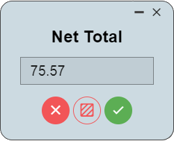
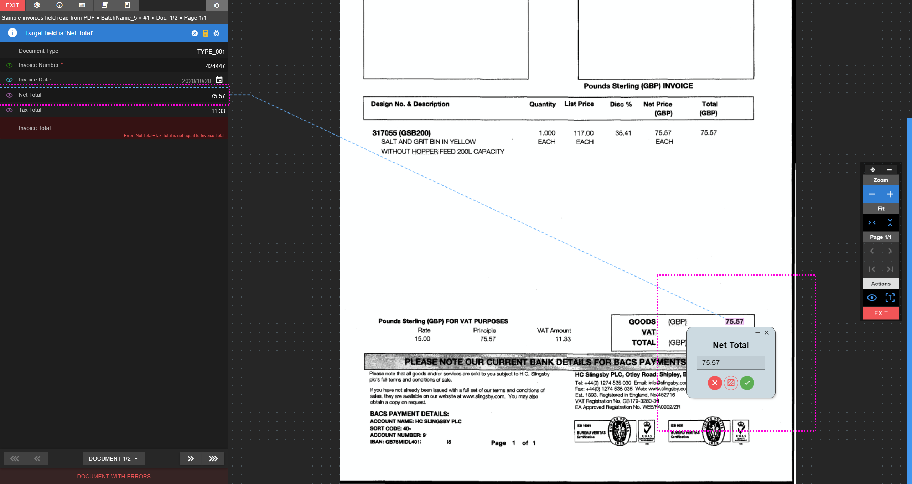

# Pop-up field form

  
<small class="img_caption">Pop-up form</small>

When a field has an image area and is selected, a pop up form will appear on the image viewer area location.

!> **Important** When a field has a pop-up field form, the **focus** of the field prevails for the pop-up form. 

> **Note** Pop-up field forms can be disabled in the [Indexer settings](./documentation/chronux/indexer/indexer-settings/index).

  
<small class="img_caption">Pop-up form over field 'Net total'</small>

