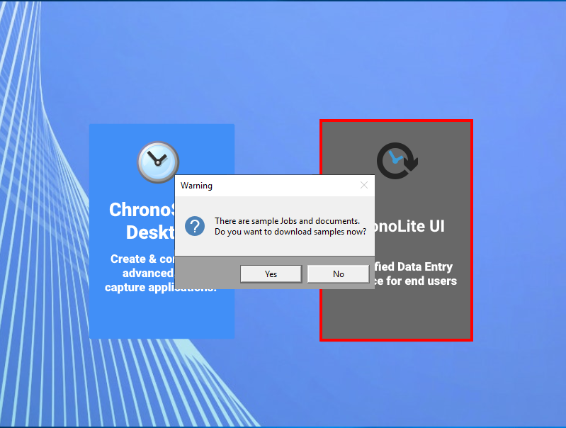

# Installing demo jobs

When opening ChronoScan for the first time, or if no job is created yet, ChronoScan will offer you the possibility of downloading the demo samples to help you understand how ChronoScan can be used.

<!--
* Click yes on the following prompt window and then on install samples.  

  
<small class="img_caption">Installing demo jobs.</small>
-->

## Sample jobs installed

The following jobs with documents will be automatically created in your ChronoScan application.

* Sample barcode reading from scanner
* Sample invoices field read for PDF
* Sample invoices field read from scanner
* Sample invoices full read from PDF
* Sample invoices full read from scanner
* Sample PDF data and table extration
* Sample scan to PDF text
* Sample working with triggers

